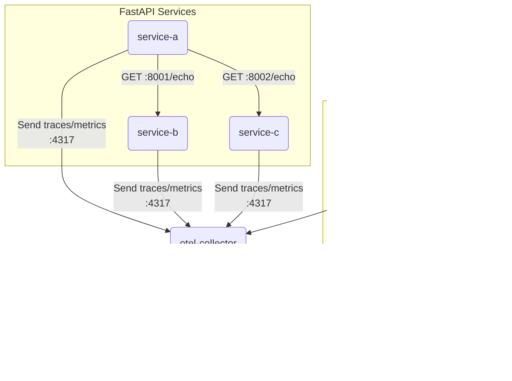
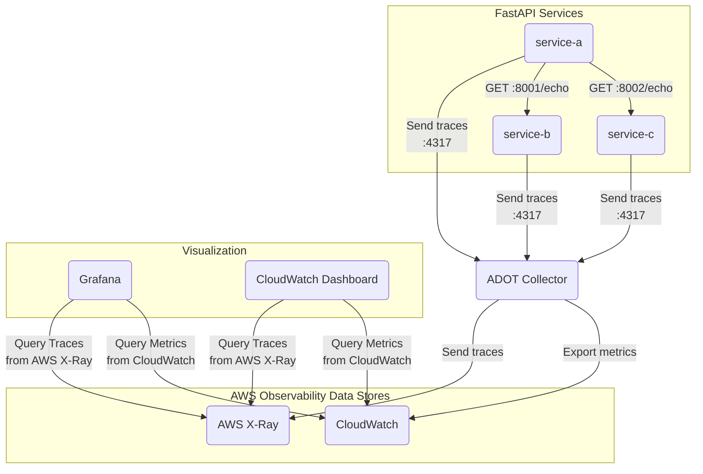

# OpenTelemetry Examples

## Open-source observability stack - `docker-compose.grafana.yaml`

```mermaid
graph TD

  subgraph FastAPI Services
    a(service-a)
    b(service-b)
    c(service-c)
  end

  otel(otel-collector)

  subgraph Observablity Data Stores
    prometheus(Prometheus)
    tempo(Tempo)
  end

  grafana(Grafana)

  a -- Send traces/metrics<br/>:4317 --> otel
  b -- Send traces/metrics<br/>:4317 --> otel
  c -- Send traces/metrics<br/>:4317 --> otel

  a -- GET :8001/echo --> b
  a -- GET :8002/echo --> c

  otel -- Send traces<br/>:4317 --> tempo
  prometheus -- Scrape metrics<br/>:9090/metrics --> otel

  grafana -- Query Traces<br/>:3200 --> tempo
  grafana -- :9090 --> prometheus
```

## AWS Observability Stack - `docker-compose.xray.yaml`

```mermaid
graph TD

  subgraph FastAPI Services
    a1(service-a)
    b1(service-b)
    c1(service-c)
  end

  adot(ADOT Collector)

  subgraph AWS Observability Data Stores
    xray(AWS X-Ray)
    cloudwatch(CloudWatch)
  end

  subgraph Visualization
    grafana(Grafana)
    cloudwatchdashboard(CloudWatch Dashboard)
  end

  a1 -- Send traces<br/>:4317 --> adot
  b1 -- Send traces<br/>:4317 --> adot
  c1 -- Send traces<br/>:4317 --> adot

  a1 -- GET :8001/echo --> b1
  a1 -- GET :8002/echo --> c1

  adot -- Send traces --> xray
  adot -- Export metrics --> cloudwatch

  grafana -- Query Traces<br/>from AWS X-Ray --> xray
  grafana -- Query Metrics<br/>from CloudWatch --> cloudwatch
  cloudwatchdashboard -- Query Traces<br/>from AWS X-Ray --> xray
  cloudwatchdashboard -- Query Metrics<br/>from CloudWatch --> cloudwatch
```